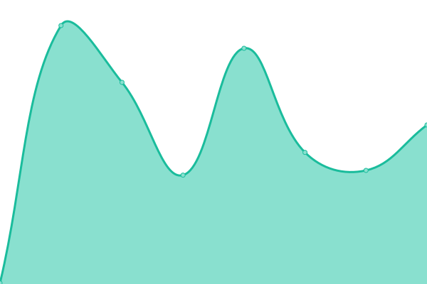

<!--start: status pages-->
<!-- This summary is generated by Upptime (https://github.com/upptime/upptime) -->
<!-- Do not edit this manually, your changes will be overwritten -->
<!-- prettier-ignore -->
| URL | Status | History | Response Time | Uptime |
| --- | ------ | ------- | ------------- | ------ |
|  [Banabyte Website](https://Banabyte.com) | 🟩 Up | [banabyte-website.yml](https://github.com/ZEROPOINTBRUH/WebsiteAlarmClock/commits/HEAD/history/banabyte-website.yml) | 

 2063ms
     
 | 

<a href="https://status2.banabyte.com/history/banabyte-website">88.75%</a>
    

|  [Banabyte CDN](https://cdn.banabyte.com) | 🟩 Up | [banabyte-cdn.yml](https://github.com/ZEROPOINTBRUH/WebsiteAlarmClock/commits/HEAD/history/banabyte-cdn.yml) | 

 219ms
     
 | 

<a href="https://status2.banabyte.com/history/banabyte-cdn">88.81%</a>
    

|  [Banabyte Panel](https://panel.banabyte.com) | 🟩 Up | [banabyte-panel.yml](https://github.com/ZEROPOINTBRUH/WebsiteAlarmClock/commits/HEAD/history/banabyte-panel.yml) | 

 233ms
     
 | 

<a href="https://status2.banabyte.com/history/banabyte-panel">88.81%</a>
    

|  [Warzon.io](https://warzon.io) | 🟩 Up | [warzon-io.yml](https://github.com/ZEROPOINTBRUH/WebsiteAlarmClock/commits/HEAD/history/warzon-io.yml) | 

 283ms
     
 | 

<a href="https://status2.banabyte.com/history/warzon-io">99.65%</a>
    

|  [DamienVespers Private Suroi Server](https://dv.suroi.io) | 🟩 Up | [damien-vespers-private-suroi-server.yml](https://github.com/ZEROPOINTBRUH/WebsiteAlarmClock/commits/HEAD/history/damien-vespers-private-suroi-server.yml) | 

 285ms
     
 | 

<a href="https://status2.banabyte.com/history/damien-vespers-private-suroi-server">99.42%</a>
    

|  [DNS SERVER 1](https://1.1.1.1) | 🟩 Up | [dns-server-1.yml](https://github.com/ZEROPOINTBRUH/WebsiteAlarmClock/commits/HEAD/history/dns-server-1.yml) | 

 43ms
     
 | 

<a href="https://status2.banabyte.com/history/dns-server-1">100.00%</a>
    

|  [DNS SERVER 2](https://dns.google) | 🟩 Up | [dns-server-2.yml](https://github.com/ZEROPOINTBRUH/WebsiteAlarmClock/commits/HEAD/history/dns-server-2.yml) | 

 133ms
     
 | 

<a href="https://status2.banabyte.com/history/dns-server-2">100.00%</a>
    

|  [Cluster 1](https://co-us01.banabyte.com:8080) | 🟩 Up | [cluster-1.yml](https://github.com/ZEROPOINTBRUH/WebsiteAlarmClock/commits/HEAD/history/cluster-1.yml) | 

 555ms
     
 | 

<a href="https://status2.banabyte.com/history/cluster-1">99.71%</a>
    

|  [Cluster 2](https://co-us02.banabyte.com:8081) | 🟩 Up | [cluster-2.yml](https://github.com/ZEROPOINTBRUH/WebsiteAlarmClock/commits/HEAD/history/cluster-2.yml) | 

 218ms
     
 | 

<a href="https://status2.banabyte.com/history/cluster-2">99.72%</a>
    

|  [Cluster 3](https://co-us03.banabyte.com:8082) | 🟩 Up | [cluster-3.yml](https://github.com/ZEROPOINTBRUH/WebsiteAlarmClock/commits/HEAD/history/cluster-3.yml) | 

 187ms
     
 | 

<a href="https://status2.banabyte.com/history/cluster-3">99.74%</a>
    

|  [Unknown](https://admin.banabyte.com) | 🟩 Up | [unknown.yml](https://github.com/ZEROPOINTBRUH/WebsiteAlarmClock/commits/HEAD/history/unknown.yml) | 

 197ms
     
 | 

<a href="https://status2.banabyte.com/history/unknown">89.01%</a>
    

|  [BanaBlock.net](https://banablock.net) | 🟩 Up | [bana-block-net.yml](https://github.com/ZEROPOINTBRUH/WebsiteAlarmClock/commits/HEAD/history/bana-block-net.yml) | 

 244ms
     
 | 

<a href="https://status2.banabyte.com/history/bana-block-net">99.77%</a>
    

<!--end: status pages-->
