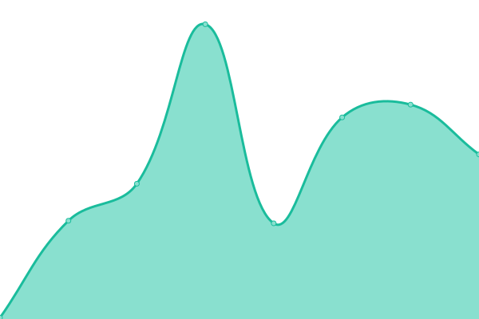
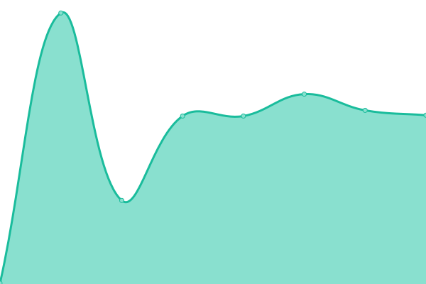

<!--start: status pages-->
<!-- This summary is generated by Upptime (https://github.com/upptime/upptime) -->
<!-- Do not edit this manually, your changes will be overwritten -->
<!-- prettier-ignore -->
| URL | Status | History | Response Time | Uptime |
| --- | ------ | ------- | ------------- | ------ |
|  [Banabyte Website](https://Banabyte.com) | 🟩 Up | [banabyte-website.yml](https://github.com/Banabyte/status.banabyte.com/commits/HEAD/history/banabyte-website.yml) | 

 272ms
     
 | 

<a href="https://status.banabyte.com/history/banabyte-website">100.00%</a>
    

|  [Banabyte CDN](https://cdn.banabyte.com) | 🟩 Up | [banabyte-cdn.yml](https://github.com/Banabyte/status.banabyte.com/commits/HEAD/history/banabyte-cdn.yml) | 

 249ms
     
 | 

<a href="https://status.banabyte.com/history/banabyte-cdn">100.00%</a>
    

|  [Banabyte Panel](https://panel.banabyte.com) | 🟩 Up | [banabyte-panel.yml](https://github.com/Banabyte/status.banabyte.com/commits/HEAD/history/banabyte-panel.yml) | 

 487ms
     
 | 

<a href="https://status.banabyte.com/history/banabyte-panel">100.00%</a>
    

|  [Banabyte Radio](https://live.banabyte.com) | 🟩 Up | [banabyte-radio.yml](https://github.com/Banabyte/status.banabyte.com/commits/HEAD/history/banabyte-radio.yml) | 

 168ms
     
 | 

<a href="https://status.banabyte.com/history/banabyte-radio">100.00%</a>
    

|  [Status Page](https://status.banabyte.com) | 🟩 Up | [status-page.yml](https://github.com/Banabyte/status.banabyte.com/commits/HEAD/history/status-page.yml) | 

 184ms
     
 | 

<a href="https://status.banabyte.com/history/status-page">100.00%</a>
    

|  [Server 1](https://co-us01.banabyte.com:2021) | 🟥 Down | [server-1.yml](https://github.com/Banabyte/status.banabyte.com/commits/HEAD/history/server-1.yml) | 

 218ms
     
 | 

<a href="https://status.banabyte.com/history/server-1">98.32%</a>
    

|  [Server 2](https://co-us02.banabyte.com:2031) | 🟩 Up | [server-2.yml](https://github.com/Banabyte/status.banabyte.com/commits/HEAD/history/server-2.yml) | 

 226ms
     
 | 

<a href="https://status.banabyte.com/history/server-2">100.00%</a>
    

|  [Server 3](https://co-us03.banabyte.com:2041) | 🟩 Up | [server-3.yml](https://github.com/Banabyte/status.banabyte.com/commits/HEAD/history/server-3.yml) | 

 223ms
     
 | 

<a href="https://status.banabyte.com/history/server-3">100.00%</a>
    

|  [BanaBlock.net](https://banablock.net) | 🟩 Up | [bana-block-net.yml](https://github.com/Banabyte/status.banabyte.com/commits/HEAD/history/bana-block-net.yml) | 

 303ms
     
 | 

<a href="https://status.banabyte.com/history/bana-block-net">100.00%</a>
    

|  [DNS SERVER 1](https://1.1.1.1) | 🟩 Up | [dns-server-1.yml](https://github.com/Banabyte/status.banabyte.com/commits/HEAD/history/dns-server-1.yml) | 

 159ms
     
 | 

<a href="https://status.banabyte.com/history/dns-server-1">100.00%</a>
    

|  [DNS SERVER 2](https://dns.google) | 🟩 Up | [dns-server-2.yml](https://github.com/Banabyte/status.banabyte.com/commits/HEAD/history/dns-server-2.yml) | 

 73ms
     
 | 

<a href="https://status.banabyte.com/history/dns-server-2">100.00%</a>
    

<!--end: status pages-->
