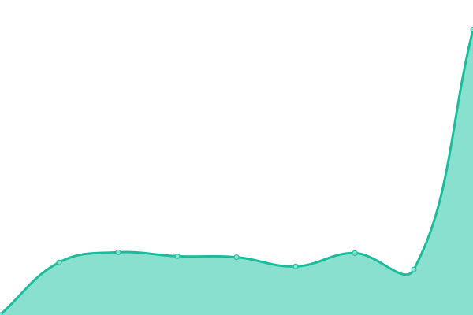

<!--start: status pages-->
<!-- This summary is generated by Upptime (https://github.com/upptime/upptime) -->
<!-- Do not edit this manually, your changes will be overwritten -->
<!-- prettier-ignore -->
| URL | Status | History | Response Time | Uptime |
| --- | ------ | ------- | ------------- | ------ |
|  [Banabyte Website](https://Banabyte.com) | 🟩 Up | [banabyte-website.yml](https://github.com/Banabyte/status.banabyte.com/commits/HEAD/history/banabyte-website.yml) | 

 217ms
     
 | 

<a href="https://status.banabyte.com/history/banabyte-website">98.04%</a>
    

|  [Banabyte CDN](https://cdn.banabyte.com) | 🟩 Up | [banabyte-cdn.yml](https://github.com/Banabyte/status.banabyte.com/commits/HEAD/history/banabyte-cdn.yml) | 

 246ms
     
 | 

<a href="https://status.banabyte.com/history/banabyte-cdn">98.10%</a>
    

|  [Banabyte Panel](https://panel.banabyte.com) | 🟩 Up | [banabyte-panel.yml](https://github.com/Banabyte/status.banabyte.com/commits/HEAD/history/banabyte-panel.yml) | 

 269ms
     
 | 

<a href="https://status.banabyte.com/history/banabyte-panel">93.03%</a>
    

|  [Banabyte Radio](https://radio.banabyte.com) | 🟩 Up | [banabyte-radio.yml](https://github.com/Banabyte/status.banabyte.com/commits/HEAD/history/banabyte-radio.yml) | 

 479ms
     
 | 

<a href="https://status.banabyte.com/history/banabyte-radio">97.97%</a>
    

|  [Status Page](https://status.banabyte.com) | 🟩 Up | [status-page.yml](https://github.com/Banabyte/status.banabyte.com/commits/HEAD/history/status-page.yml) | 

 144ms
     
 | 

<a href="https://status.banabyte.com/history/status-page">100.00%</a>
    

|  [Banabyte Forum](https://forum.banabyte.com) | 🟩 Up | [banabyte-forum.yml](https://github.com/Banabyte/status.banabyte.com/commits/HEAD/history/banabyte-forum.yml) | 

 3364ms
     
 | 

<a href="https://status.banabyte.com/history/banabyte-forum">93.20%</a>
    

|  [Server 1](https://co-us01.banabyte.com:2021) | 🟩 Up | [server-1.yml](https://github.com/Banabyte/status.banabyte.com/commits/HEAD/history/server-1.yml) | 

 176ms
     
 | 

<a href="https://status.banabyte.com/history/server-1">100.00%</a>
    

|  [Server 2](https://co-us02.banabyte.com:2031) | 🟩 Up | [server-2.yml](https://github.com/Banabyte/status.banabyte.com/commits/HEAD/history/server-2.yml) | 

 189ms
     
 | 

<a href="https://status.banabyte.com/history/server-2">100.00%</a>
    

|  [Server 3](https://co-us03.banabyte.com:2041) | 🟩 Up | [server-3.yml](https://github.com/Banabyte/status.banabyte.com/commits/HEAD/history/server-3.yml) | 

 192ms
     
 | 

<a href="https://status.banabyte.com/history/server-3">100.00%</a>
    

|  [Network Backend](https://admin.banabyte.com) | 🟩 Up | [network-backend.yml](https://github.com/Banabyte/status.banabyte.com/commits/HEAD/history/network-backend.yml) | 

 207ms
     
 | 

<a href="https://status.banabyte.com/history/network-backend">98.16%</a>
    

|  [BanaBlock.net](https://banablock.net) | 🟩 Up | [bana-block-net.yml](https://github.com/Banabyte/status.banabyte.com/commits/HEAD/history/bana-block-net.yml) | 

 2136ms
     
 | 

<a href="https://status.banabyte.com/history/bana-block-net">98.24%</a>
    

|  [Donetsk.live](https://donetsk.live) | 🟥 Down | [donetsk-live.yml](https://github.com/Banabyte/status.banabyte.com/commits/HEAD/history/donetsk-live.yml) | 

 126ms
     
 | 

<a href="https://status.banabyte.com/history/donetsk-live">15.88%</a>
    

|  [Support.Donetsk.live](https://support.donetsk.live) | 🟥 Down | [support-donetsk-live.yml](https://github.com/Banabyte/status.banabyte.com/commits/HEAD/history/support-donetsk-live.yml) | 

 157ms
     
 | 

<a href="https://status.banabyte.com/history/support-donetsk-live">12.94%</a>
    

|  [Warzon.io](https://warzon.io) | 🟩 Up | [warzon-io.yml](https://github.com/Banabyte/status.banabyte.com/commits/HEAD/history/warzon-io.yml) | 

 295ms
     
 | 

<a href="https://status.banabyte.com/history/warzon-io">98.26%</a>
    

|  [DamienVespers Private Suroi Server](https://dv.suroi.io) | 🟥 Down | [damien-vespers-private-suroi-server.yml](https://github.com/Banabyte/status.banabyte.com/commits/HEAD/history/damien-vespers-private-suroi-server.yml) | 

 0ms
     
 | 

<a href="https://status.banabyte.com/history/damien-vespers-private-suroi-server">0.00%</a>
    

|  [DNS SERVER 1](https://1.1.1.1) | 🟩 Up | [dns-server-1.yml](https://github.com/Banabyte/status.banabyte.com/commits/HEAD/history/dns-server-1.yml) | 

 46ms
     
 | 

<a href="https://status.banabyte.com/history/dns-server-1">100.00%</a>
    

|  [DNS SERVER 2](https://dns.google) | 🟩 Up | [dns-server-2.yml](https://github.com/Banabyte/status.banabyte.com/commits/HEAD/history/dns-server-2.yml) | 

 135ms
     
 | 

<a href="https://status.banabyte.com/history/dns-server-2">100.00%</a>
    

<!--end: status pages-->
