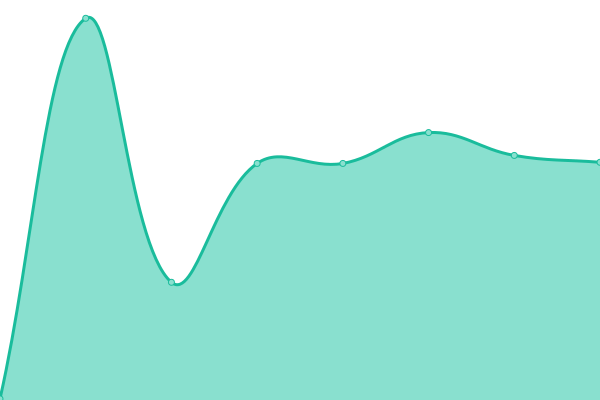

<!--start: status pages-->
<!-- This summary is generated by Upptime (https://github.com/upptime/upptime) -->
<!-- Do not edit this manually, your changes will be overwritten -->
<!-- prettier-ignore -->
| URL | Status | History | Response Time | Uptime |
| --- | ------ | ------- | ------------- | ------ |
|  [Banabyte Website](https://Banabyte.com) | 🟩 Up | [banabyte-website.yml](https://github.com/Banabyte/status.banabyte.com/commits/HEAD/history/banabyte-website.yml) | 

 2434ms
     
 | 

<a href="https://uptime.banabyte.com/history/banabyte-website">99.56%</a>
    

|  [Banabyte CDN](https://cdn.bbyte.app) | 🟩 Up | [banabyte-cdn.yml](https://github.com/Banabyte/status.banabyte.com/commits/HEAD/history/banabyte-cdn.yml) | 

 240ms
     
 | 

<a href="https://uptime.banabyte.com/history/banabyte-cdn">99.24%</a>
    

|  [Banabyte Panel](https://panel.banabyte.com) | 🟩 Up | [banabyte-panel.yml](https://github.com/Banabyte/status.banabyte.com/commits/HEAD/history/banabyte-panel.yml) | 

 449ms
     
 | 

<a href="https://uptime.banabyte.com/history/banabyte-panel">99.76%</a>
    

|  [Status Page](https://status.banabyte.com) | 🟩 Up | [status-page.yml](https://github.com/Banabyte/status.banabyte.com/commits/HEAD/history/status-page.yml) | 

 258ms
     
 | 

<a href="https://uptime.banabyte.com/history/status-page">100.00%</a>
    

<!--end: status pages-->
